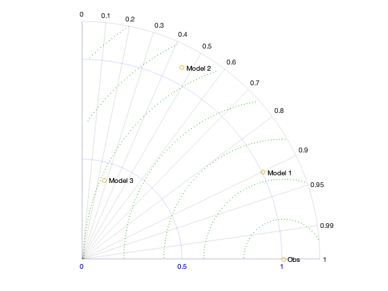
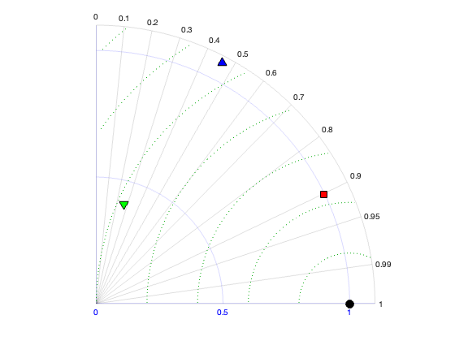
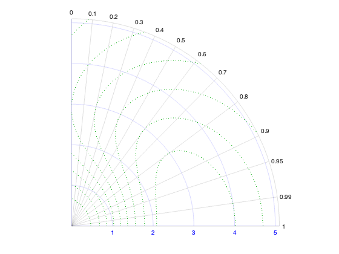

# skillstats.m: Calculate (and plot) skill statistics for model validation


Author: Kelly Kearney


This repository includes the code for the `skillstats.m` and `tayoloraxis.m` Matlab functions.


The primary `skillstats.m` function calculates a variety of statistics useful in assessing the skill of a model dataset relative to a reference dataset. These statistics can be used to produce skill summary diagrams like Taylor diagrams (Taylor 2001, J Geophys Res Atmos 106:7183-7192) or target diagrams (Jolliff et al. 2009, J Mar Syst 76:64-82).  The example below illustrates how to create these diagrams in Matlab by relying on built-in Matlab plotting functions and the included `tayloraxis.m` function.


## Contents

            
- Getting started        
- Syntax        
- Examples        
- My approach to plotting tools        
- A standard Taylor diagram        
- Normalized Taylor diagram        
- Subfunction        
- Contributions

## Getting started


**Prerequisites**


The `skillstats` function should run in Matlab R2007a or later (note: uses bsxfun in favor of newer implicit expansion to maintain back-compatibility).  The `tayloraxis.m` function requires R2016a or later due to its reliance on polar axis objects.


**Downloading and installation**


This code can be downloaded from [Github](https://github.com/kakearney/skillstats-pkg/)


**Matlab Search Path**


The following folders need to be added to your Matlab Search path (via `addpath`, `pathtool`, etc.):


```matlab
skillstats-pkg/skillstats
```


## Syntax


```
S = skillstats(r, f)
```


Input variables:


  - `r`: n x 1 array, values of reference (observed) variable
  - `f`: n x m array, values of modeled/predicted variable, for m different models

Output variables:


`S`: 1 x 1 structure with the following fields; all are 1 x m+1 arrays, where the first element corresponds to the reference data and 2:end correspond to the models.


  - `std`: standard deviation, normalized to n.
  - `cor`: correlation coefficient
  - `rmsd`: root mean squared difference
  - `crmsd`: centered pattern (i.e. unbiased) root mean squared difference
  - `bias`: bias, i.e. average error
  - `stdnorm`: normalized standard deviation
  - `rmsdnorm`: root mean squared difference, normalized to standard deviation of reference data
  - `crmsdnorm`: centered root mean squared difference, normalized to standard deviation of reference data
  - `aae`: average absolute error
  - `ri`: reliability index (factor by which model differs from reference... note that this metric falls apart if any of the modeled values are 0).
  - `mef`: modeling efficiency (skill relative to average of observations, 1 = perfect, 0 = same as averaging obs, &lt;1 = worse than just averaging observations)


## Examples


In the earth sciences, Taylor and target diagrams are common summary diagrams used to visually depict the relative skill of different models (or subsets of output from models) relative to a reference dataset. These diagrams rely on the relationships between common skill metrics such as bias, correlation, standard deviation, and root mean squared error.


For our example, we start with an "observation" sequence, which I'll just create as a Gaussian random sequence.  I'll set the random number stream so this example is reproducible.


```matlab
rng(1);
n = 5000;
yobs = randn(n,1);
```


And we'll create a few "models" of this with different types of error.


```matlab
cor = [0.9 0.5 0.1];  % Correlation
bias = [0 -1 1];      % Bias
scale = [1 1.1 0.4];  % Scaling factor

y = randn(n,3);
y = ((cor.*yobs) + (sqrt(1-cor.^2).*y).*scale + bias);
```


When we call skillstats, we can see the expected relationships in the cor (correlation), bias, and stdnorm (normalized standard deviation) fields:


```matlab
S = skillstats(yobs, y)
```


```

S = 

  struct with fields:

          std: [1.0089 1.005 1.0816 0.41046]
          cor: [1 0.90141 0.46229 0.27152]
         rmsd: [0 0.44719 1.4539 1.4001]
        crmsd: [0 0.44715 1.0857 0.98051]
         bias: [0 -0.0062747 -0.96708 0.9994]
      stdnorm: [1 0.99619 1.0721 0.40686]
     rmsdnorm: [0 0.44327 1.4412 1.3878]
    crmsdnorm: [0 0.44323 1.0762 0.9719]
     biasnorm: [0 -0.0062196 -0.9586 0.99063]
          aae: [0 0.35694 1.199 1.1598]
           ri: [1 +          0i 1.0017 +   0.004868i 1.0058 -   0.018416i &#8230; ]
          mef: [1 0.80351 -1.077 -0.92595]


```


## My approach to plotting tools


Before we get into plotting, I'll add a quick forward about my approach to these plotting functions.  You'll notice that, unlike many other Taylor diagram functions out there, I didn't provide any tools to actually plot the data on the different axes.  That was an intentional choice; I prefer to keep things as flexible as possible for the end user. As long as you understand what the various axes represent in these diagrams, you're then free to adapt that as necessary, e.g. using different plotting types (lines, points, scatter, etc.), labeling, colors, etc. It's a little more work sometimes, but I prefer that over functions that take a heavy-handed approach and try to set everything. My hope is that these examples provide a template for how to create the basics!


## A standard Taylor diagram


We'll first visualize the relationships with a Taylor diagram.  Taylor diagrams are basically polar plots with the radial axis corresponding to standard deviation and the azimuthal axis proportional to the correlation (specifically, real(cos(cor))).


```matlab
c2theta = @(c) real(acos(c)); % The Taylor diagram theta coordinate

% Set up axis

h = tayloraxis('stdmax', max(S.std)*1.1, 'npanel', 1, 'stdref', S.std(1), 'rmsdtick', 0.2);

% Plot all models (as one line object)

hln = polarplot(c2theta(S.cor), S.std, 'o');

% Add text labels

htxt = text(c2theta(S.cor), S.std, ["  Obs", compose("  Model %d", 1:3)]);
```





## Normalized Taylor diagram


You can also create the normalized variant, which can be useful if comparing data across different scales (for example, different variables from the same model).  Here, I also plot each point as a separate line object (the *[1;1] bit turns the row vectors into matrices, a useful shortcut for plotting row vector elements separately).


```matlab
% Set up axis

cla;
h = tayloraxis('stdmax', 1.1, 'npanel', 1, 'stdref', 1, 'rmsdtick', 0.2);

% Plot circles for each model

hln = polarplot(c2theta(S.cor).*[1;1], S.stdnorm.*[1;1], 'o');

% Change the colors, marker shapes, and marker size

set(hln, {'markerfacecolor'}, {'k';'r';'b';'g'}, ...
         {'marker'}, {'o';'s';'^';'v'}, ...
         'color', 'k', ...
         'markersize', 10)
```




In a typical Taylor diagram, like the ones shown above, cRMSE is depicted as concentric circles extending from the observation marker.  But in his original paper, Taylor mentions a few alternatives to this skill score. Here's an example of how to add those alternative types of reference lines to the plot, replicating Taylor's Fig. 10.


```matlab
% We can't contour directly onto a polar plot (unfortunately), so we'll
% need to calculate the coordinates of the contours outselves.

cla;
h = tayloraxis('stdmax', 5.1, 'npanel', 1, 'stdref', 2.8);

[cor,sig] = ndgrid(linspace(0,1,100), linspace(0,5.1,150));

R0 = 0.9976;
sighat = sig./2.9;
skillval = 4.*(1 + cor)./((sighat + 1./sighat).^2.*(1 + R0));

htmp = figure('visible', 'on');
[cmat, hc] = contour(sig, cor, skillval, 0.1:0.1:0.9);
close(htmp);
C = cmat2struct(cmat);

% Then we can plot these, using similar colors as the default RMSD lines
% (which we then hide).

for ic = 1:length(C)
    polarplot(real(acos(C(ic).Y)), C(ic).X, 'color', h.rmsdline(1).Color, 'linestyle', ':');
end
set(h.rmsdline, 'visible', 'off');
set(h.ax, 'RTick', 1:5);
```




While Taylor diagrams depict correlation, scale of variability, and RMSE, they don't indicate whether models might be biased.  Joliff et al. (2009) proposed a target diagram that again takes advantage of relationships to depict centered pattern (i.e. unbiased) root mean squared error, bias, and total root mean square error.  We can build this type of plot using Matlab's built-in plotting tools.


```matlab
figure;
plot(S.crmsd.*sign(S.std - S.std(1)), S.bias, 'o');
lim = 1.5;
set(gca, 'xlim', [-1 1]*lim, 'ylim', [-1 1]*lim, 'yaxisloc', 'origin', 'xaxisloc', 'origin');
xlabel('RMSD''');
ylabel('bias');
axis equal;
```


You can add the reference RMSD rings if desired.


```matlab
hold on;
[r, th] = meshgrid(0:0.5:2, linspace(0, 2*pi, 100));
plot(r.*cos(th), r.*sin(th), ':k');
```


## Subfunction


(This is the subfunction I used above to extract contour line coordinates from the clunky contour matrix Matlab returns from contour plots).


```matlab
function Cout = cmat2struct(C)

K = 0;
n0 = 1;
while n0&lt;=size(C,2)
   K = K + 1;
   n0 = n0 + C(2,n0) + 1;
end

% initialize output struct
el = cell(K,1);
Cout = struct('Level',el,'Length',el,'X',el,'Y',el);

% fill the output struct
n0 = 1;
for k = 1:K
   Cout(k).Level = C(1,n0);
   idx = (n0+1):(n0+C(2,n0));
   Cout(k).Length = C(2,n0);
   Cout(k).X = C(1,idx);
   Cout(k).Y = C(2,idx);
   n0 = idx(end) + 1; % next starting index
end
end
```


## Contributions


Community contributions to this package are welcome!


To report bugs, please submit [an issue](https://github.com/kakearney/skillstats-pkg/issues) on GitHub and include:


  - your operating system
  - your version of Matlab and all relevant toolboxes (type `ver` at the Matlab command line to get this info)
  - code/data to reproduce the error or buggy behavior, and the full text of any error messages received

Please also feel free to submit enhancement requests, or to send pull requests (via GitHub) for bug fixes or new features.


I do monitor the MatlabCentral FileExchange entry for any issues raised in the comments, but would prefer to track issues on GitHub.


<sub>[Published with MATLAB R2023a]("http://www.mathworks.com/products/matlab/")</sub>
